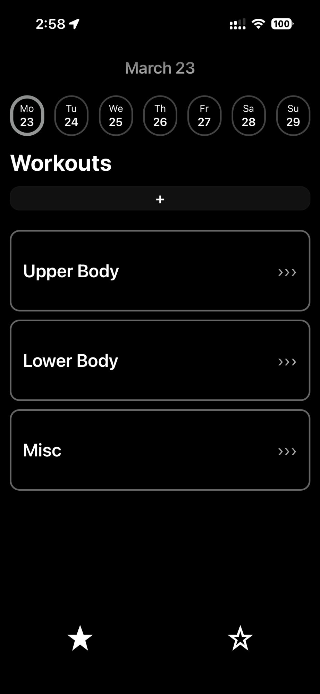
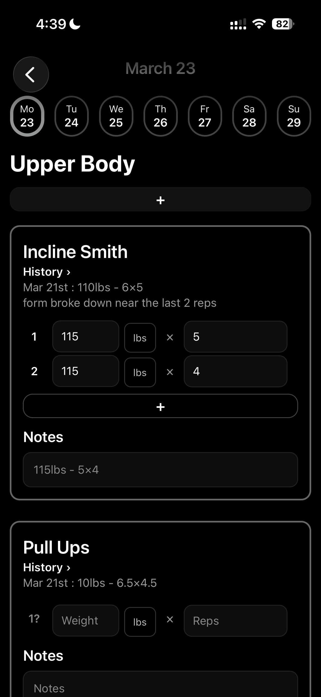
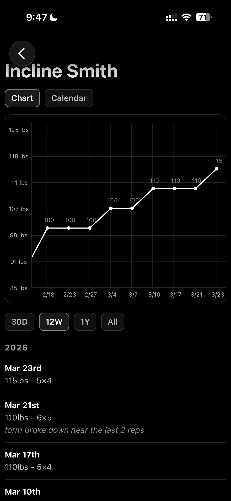
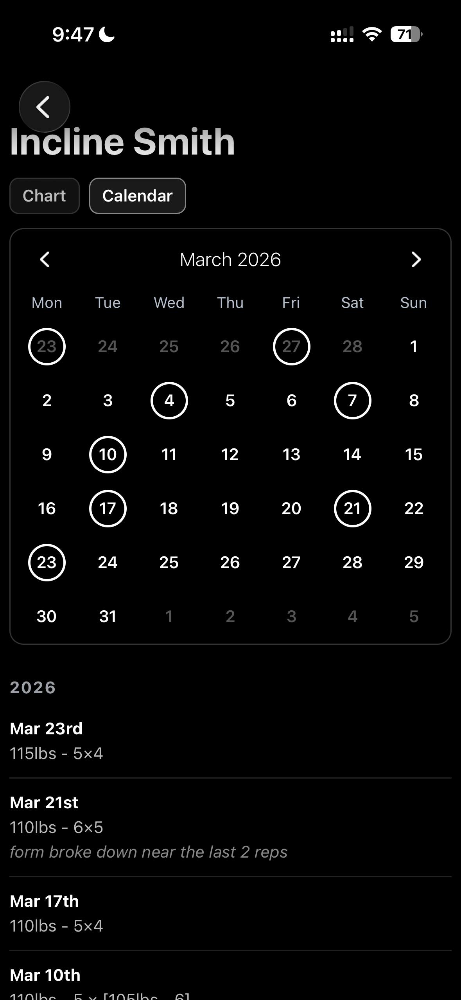
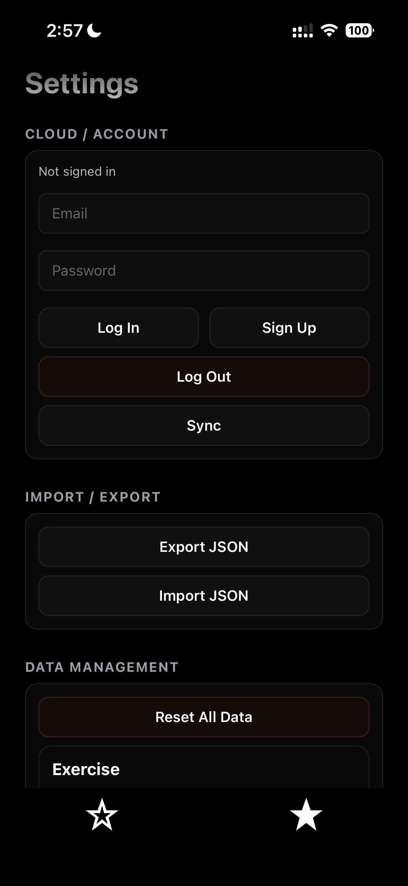
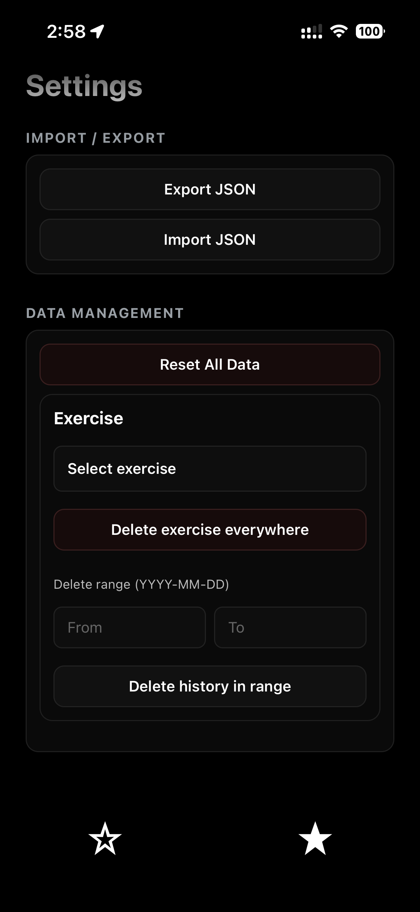

# StarSet

A workout tracker built with React Native + Expo to feel as seamless as logging in Notes, while adding structured history, progress charts, calendar views, and optional cloud-backed sync.

Instead of pushing users through a clunky multi-screen flow for every action, StarSet keeps workout logging fast, visually clear, and low-friction during actual use. The goal was to keep the experience simple and fast during actual workouts while still giving users better long-term visibility into their training data.

For a deeper breakdown of these UX decisions, see [`DESIGN.md`](./DESIGN.md)

---

## Demo

<div align="center">
  <video src="https://github.com/user-attachments/assets/2e1e1f7a-3a62-40ae-b638-1c4d7c29c841" width="300"/>
</div>

## Tech Stack

**Frontend:** React Native, Expo, Expo Router (Javascript)

**Local Storage:** expo-sqlite

**Cloud / Auth / Sync:** Supabase, Row Level Security (RLS)

**Visualization:** react-native-gifted-charts

---

## Why I Built This

I built StarSet because the workout logging tools I tried all had the same problem, too much friction.

When I was actually training, the easiest thing to use was often just the Notes app. It was fast, straightforward, and took almost no effort to open and log something. But Notes breaks down over time as there's no clean structure, no real progress visualization, and no good way to review patterns across weeks or months.

On the other hand, many fitness apps solve that by adding a lot more UI, but end up feeling clunky. Logging even a single exercise can take multiple screens, too many taps, and too much friction which became kind of annoying very quickly.

StarSet was my attempt to build something in between:

- As seamless and low-friction as Notes for day-to-day logging
- But structured enough to support exercise history, charts, calendar views, and long-term progression
- With a UI that stays focused on the current workout instead of constantly redirecting the user through nested flows

---

## Screenshots

<p align="center">
  
  &nbsp;&nbsp;
  
  &nbsp;&nbsp;
  
</p>

<p align="center">
  
  &nbsp;&nbsp;
  
  &nbsp;&nbsp;
  
</p>

---

## Features

- Fast, low-friction workout logging
- Create and organize workouts
- Add exercises with different tracking styles and units
- Log sets and notes directly from the workout screen
- View exercise progress with charts and calendar-based history
- Export and import workout data as JSON
- Use the app fully offline with SQLite
- Optionally sign in with Supabase for cloud-backed sync
- Background auto-sync after local saves
- Minimal UI designed around speed, clarity, and repeated daily use

---

## Architecture

StarSet was designed around a UX requirement first: logging should feel immediate.

To support that, the app uses SQLite as its primary local data store and writes locally before doing any cloud work. That means user actions feel instant and reliable without waiting on a network connection.

Supabase is layered on top as optional cloud infrastructure for:

- Authentication
- User-scoped data storage
- Background syncing of core workout history

This keeps the product usable as a local-only app while still supporting cloud-backed continuity when the user wants it.

### Local-First Data Model

The app uses SQLite as its primary working database. All major user actions write locally first — creating exercises, updating workouts, logging sessions, adding/editing sets, deleting entries, and reordering elements. This keeps the UI fast and allows the app to work without internet or login.

### Optional Cloud Sync

When the user is signed in, the app syncs core data (exercises, sessions, sets) to Supabase. Sync is background-driven and designed to avoid blocking the workout flow.

The sync system uses:

- Dirty flags for unsynced local changes
- Soft deletes / tombstones via `deletedAt`
- Client-generated UUIDs
- Client edit timestamps (`client_updated_ms`)
- Push-first then pull-second sync order

This lets the app preserve real client edit times instead of relying only on server timestamps, which is especially important for offline edits uploaded later.

### Conflict Strategy

The app currently uses a practical last-write-wins strategy based on client-side edit timestamps. That gives StarSet a solid MVP sync model while keeping the implementation understandable and maintainable.

---

## Data Model

Core tables in the local SQLite schema:

- `workouts`
- `exercises`
- `workout_exercises`
- `sessions`
- `sets`

Important schema decisions:

- **Exercises are decoupled from workouts.** A workout is essentially a folder. The same exercise can appear in multiple workouts via a many-to-many junction table (`workout_exercises`), and all history stays unified. This means progress data is never fragmented across workout routines.
- **Quantity + Unit model for sets.** Each set stores a raw quantity value and a separate unit field rather than a single pre-converted number. Unit conversions (such as kg ↔ lbs) are handled at the display layer, keeping stored data lossless and making it easy to add new unit types later.
- **YMD-based sessions.** Sessions are keyed by date only (`exerciseId`, `utcKey`), not by start/stop timestamps. This eliminates the need for session timers or explicit start/end flows and simplifies timezone handling, dates are converted to UTC day keys at write time so a session logged at 11pm in one timezone doesn't split across two days.
- **Exercise deduplication by name.** When adding exercises, the app merges by name rather than generating a new ID each time. This prevents duplicates from appearing when the same exercise is added across different workouts or re-imported after an export.
- **Soft deletes** instead of immediate hard deletes for syncable records, with tombstones via `deletedAt`.
- **Ordering support** for both workouts and sets via explicit sort-order fields, supporting easy reorder.
- **Local dirty flags** to track pending sync state.

Supabase mirrors the core syncable entities and enforces user ownership through Row Level Security policies.

---

## Engineering Decisions

### 1. Optimized for Low-Friction Logging

The main product goal was reducing friction. Logging should feel closer to typing into Notes than navigating a heavy fitness app. There are no session timers, no completion checklists, and no "start workout" button >> the user just opens a workout and starts entering sets. New set rows spawn automatically as data is entered.
That influenced the entire structure: local saves happen first, common actions stay close to the main workout screen, and cloud sync happens in the background instead of interrupting the user.

### 2. Date-Keyed Sessions Instead of Start/Stop

Sessions are keyed by `(exerciseId, utcKey)` where `utcKey` is a UTC date string, not a timestamp range. This was a deliberate modeling choice — it eliminates the need for start/stop session management, avoids timezone edge cases where a late-night session could split across two days, and maps cleanly to how people actually think about training ("what did I do on Tuesday") rather than precise time windows.

### 3. Shared Exercises Across Workouts

Exercises exist independently of any single workout. A workout is a grouping container, not an owner. The same exercise can appear in multiple workouts and all its session history, charts, and progression stay unified regardless of which workout the user logged from. This required a junction table (`workout_exercises`) and careful separation of exercise identity from workout membership.

### 4. Separate Client Edit Time from Server Update Time

`client_updated_ms` was added to the cloud schema because server `updated_at` alone is not enough for correct conflict decisions. An offline edit uploaded later should not incorrectly appear newer just because it reached the server later.

### 5. Push Before Pull

Sync uploads local unsynced changes before downloading remote updates. This protects fresh local edits first and reduces the chance of stale cloud state overriding the user's latest changes.

### 6. Background Sync Instead of Blocking Sync

After local saves, the app requests a debounced background sync rather than forcing the user to wait. This keeps the app feeling instant while still maintaining cloud consistency when signed in.

---

## What I Learned

This project taught me a lot about the relationship between product design and engineering.

The most interesting part was that many of the "simple" UX goals such fast logging, low friction, staying in context, not interrupting the user, actually required more technical work underneath.

It also made me much more conscious of interaction cost — how many taps should this take, does this need a new screen, should the user have to think about this, what belongs in the moment of logging vs later review.

A UI only feels seamless when the architecture supports it.

---

## Running the Project

### Prerequisites

- Node.js
- Expo CLI via `npx expo`
- iOS Simulator / Android Emulator / Expo Go
- Supabase project configured with the required schema

### Install

```bash
npm install
```

### Start

```bash
npx expo start
```

### Environment Variables

Create a `.env` file with:

```
EXPO_PUBLIC_SUPABASE_URL=your_supabase_url
EXPO_PUBLIC_SUPABASE_ANON_KEY=your_supabase_anon_key
```
